# 后端
## 1 conda常用指令
```
conda env list # 查看已有环境
conda create -n ml python=3.7 # 创建名为ml的python3.7环境
conda activate ml # 激活ml环境
conda deactivate # 退出当前环境
conda remove -n ml --all # 删除ml环境
```

## 2 django
## 2.1 启动一个django项目
```
django-admin startproject ml # 创建django项目
cd ml # 进入项目目录
python manage.py runserver # 启动服务器
python manage.py startapp polls # 创建一个polls应用
```
一个project包含一个或多个app，一个app包含多个models、views、urls、templates等文件。
## 2.2 url与视图函数映射
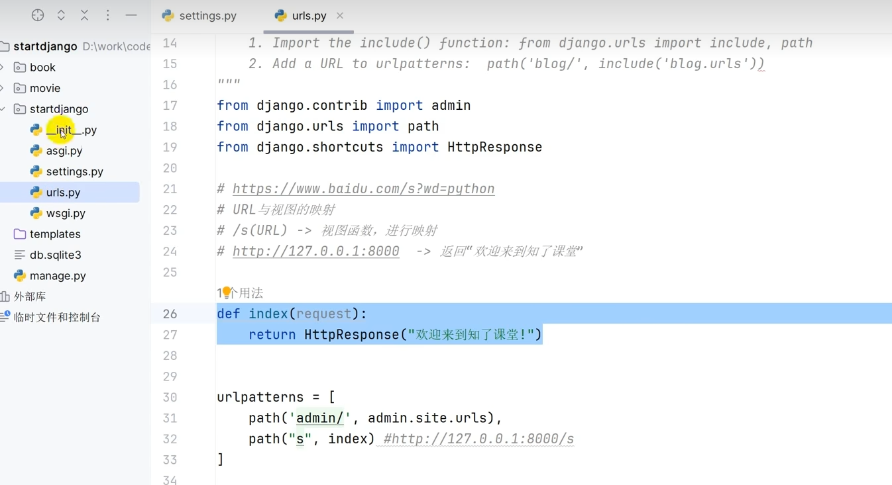
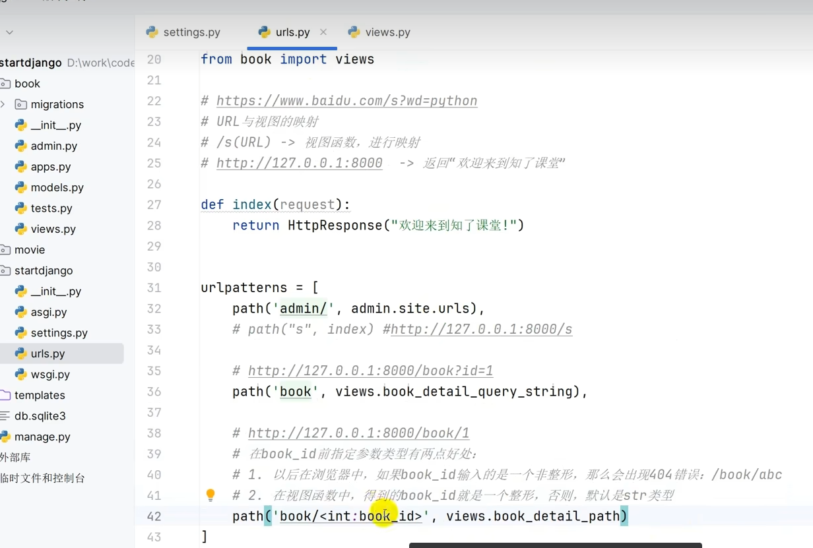

## 2.3 路由path函数
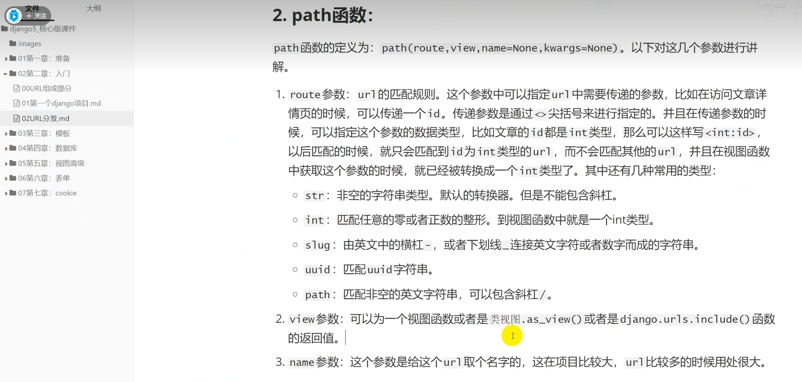
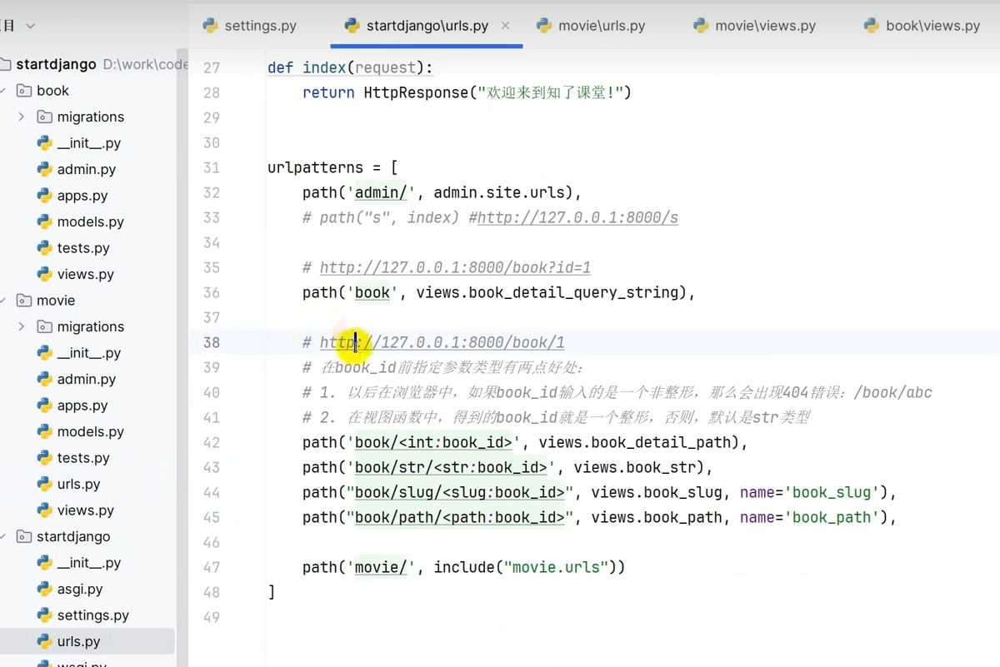
```
path('movies/',include("movies.urls")) # 导入movies模块的urls.py文件
```
## 2.4 模板渲染
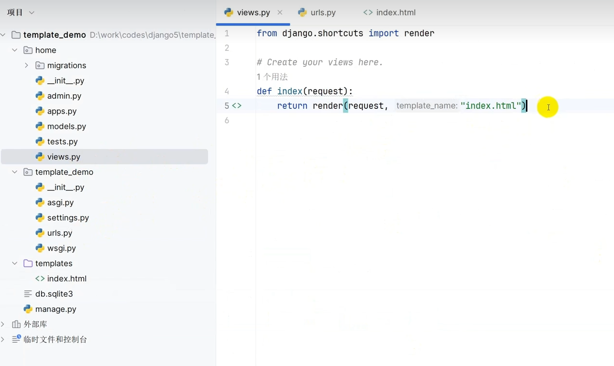 
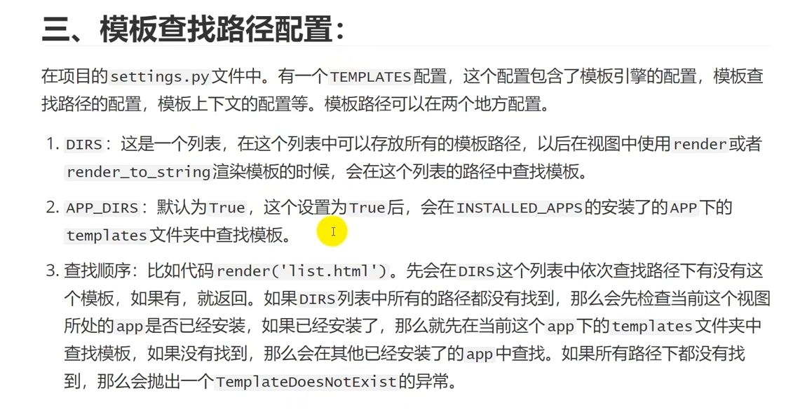 
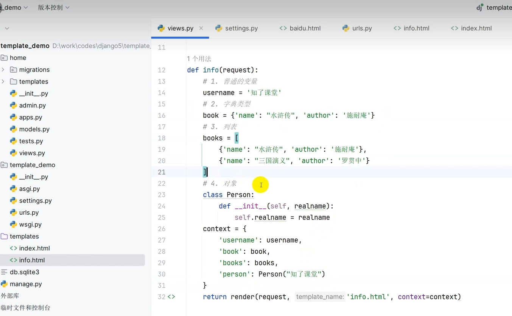

## 2.5 数据库
数据库配置主要是在settings.py文件中进行配置，主要包括数据库类型、数据库名称、用户名、密码、主机地址、端口号等信息。
```
DATABASES = {
    'default': {
        'ENGINE': 'django.db.backends.mysql',
        'NAME': 'polls',
        'USER': 'root',
        'PASSWORD': '123456',
        'HOST': 'localhost',
        'PORT': '3306',
    }
}
```

## 2.6 ORM
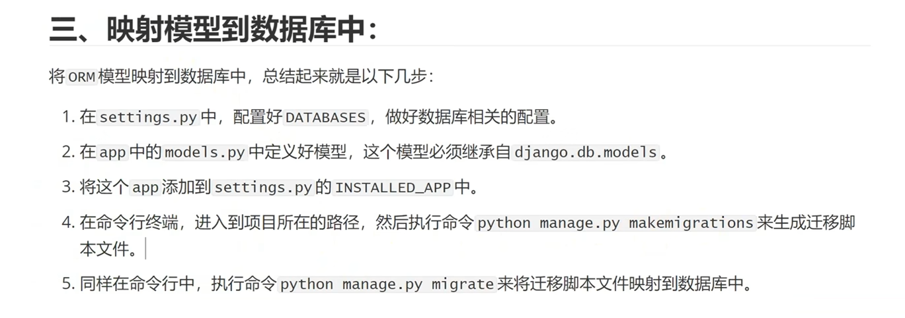
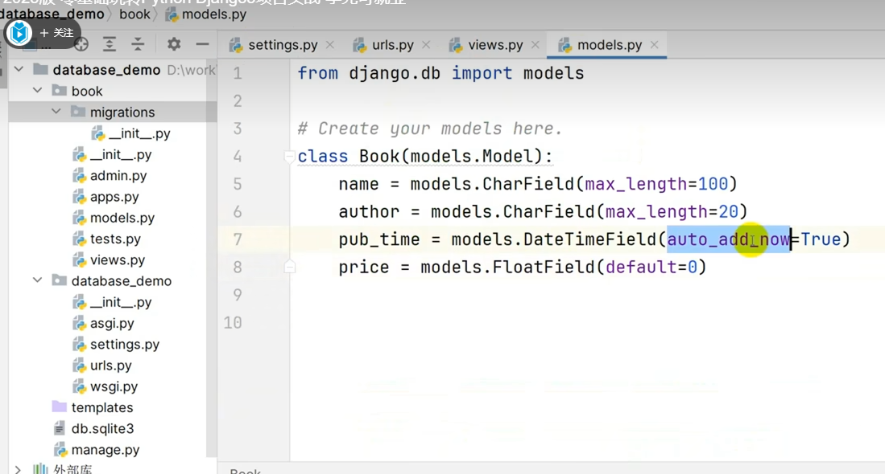
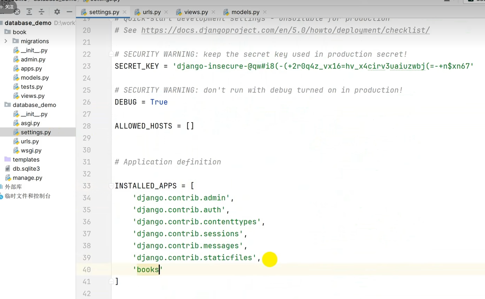

增删改查：
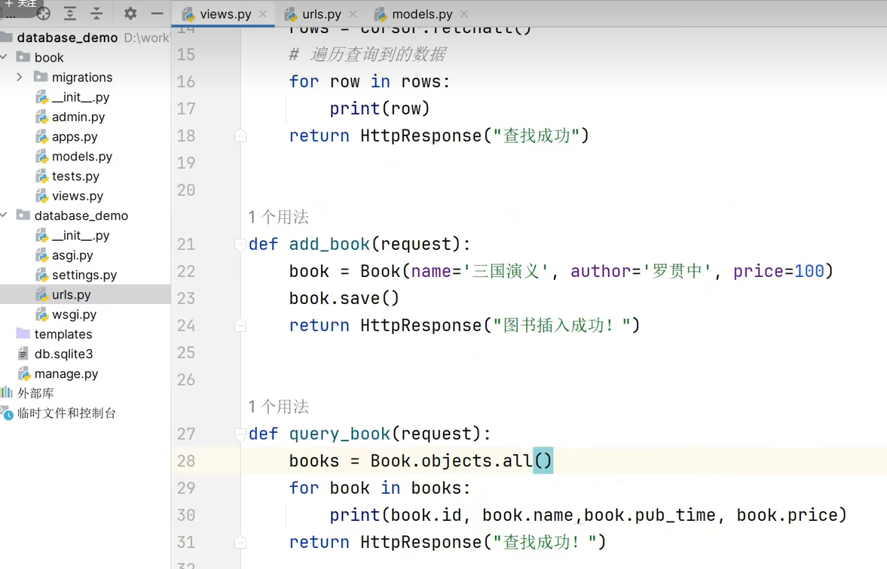

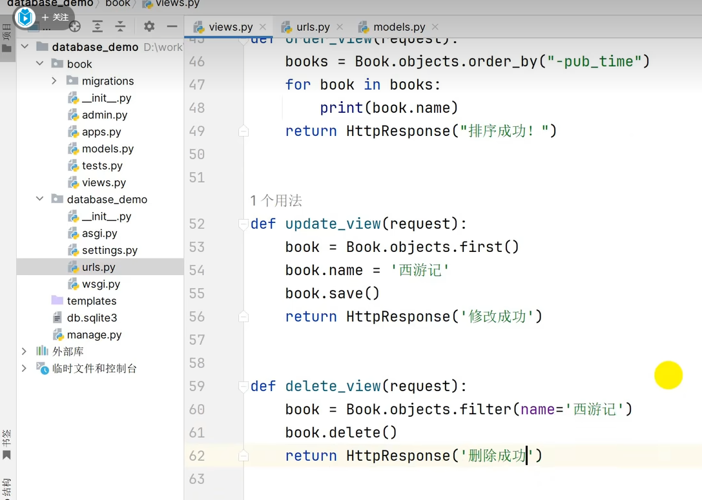
